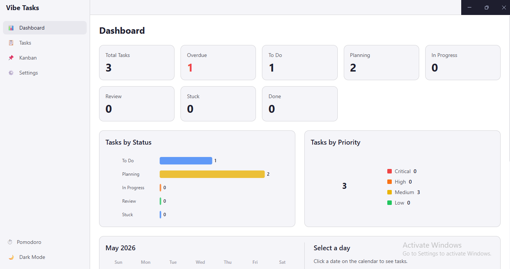
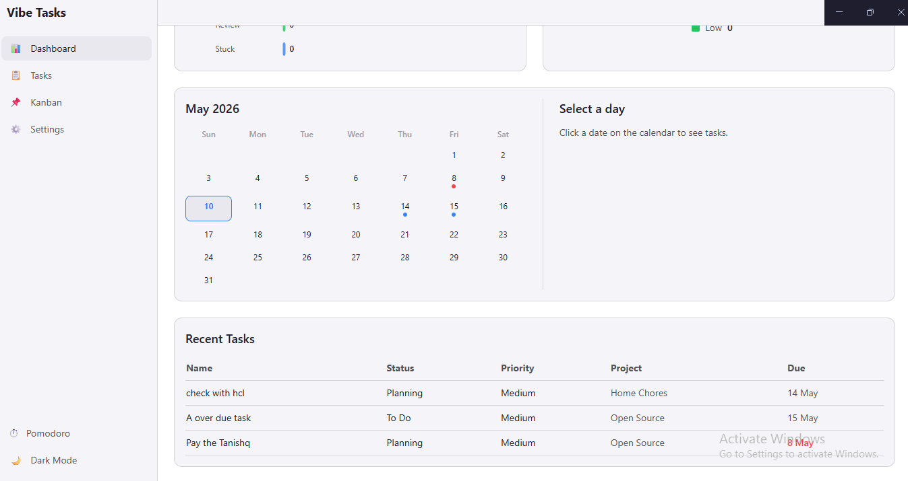
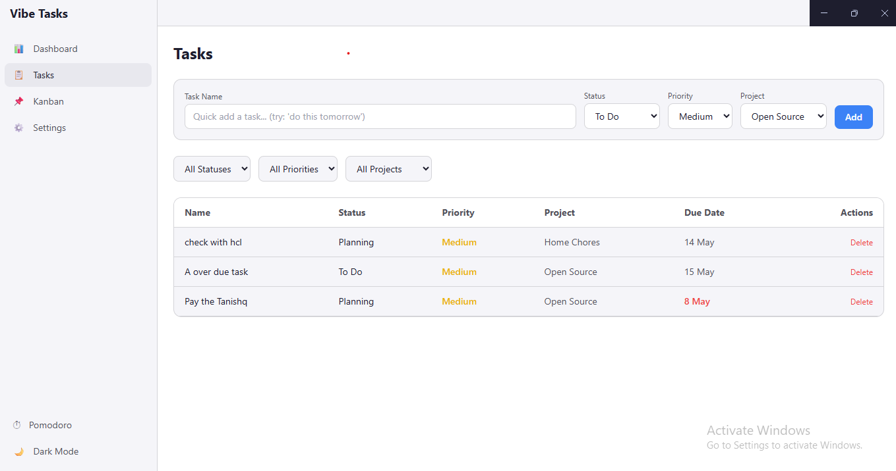
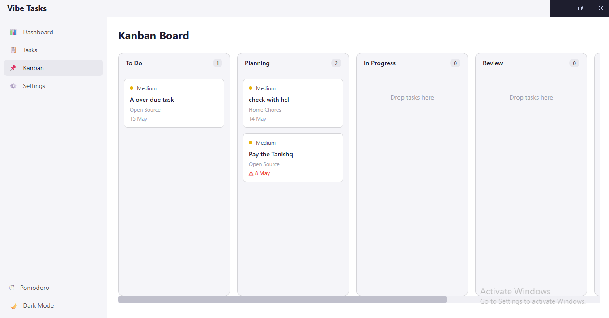
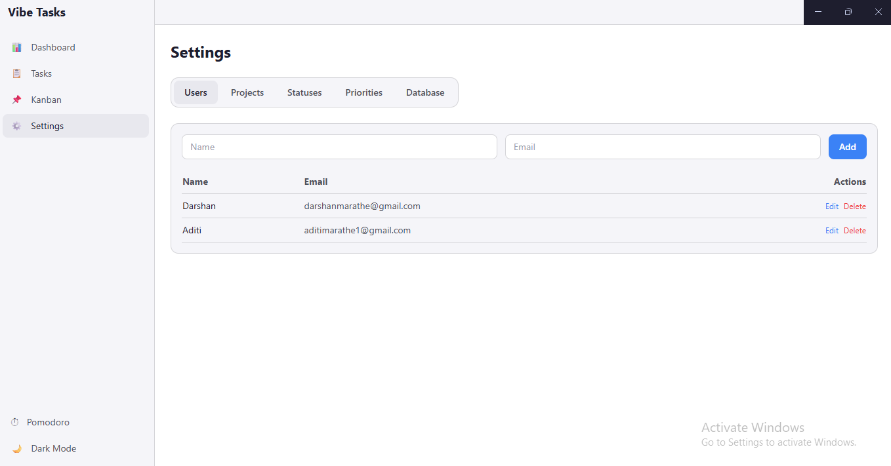
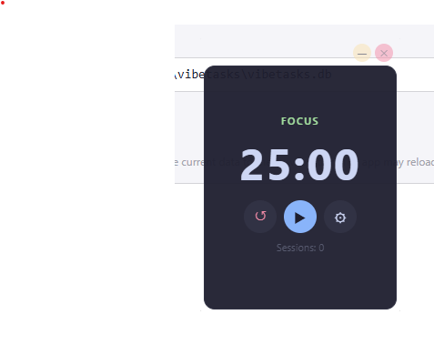
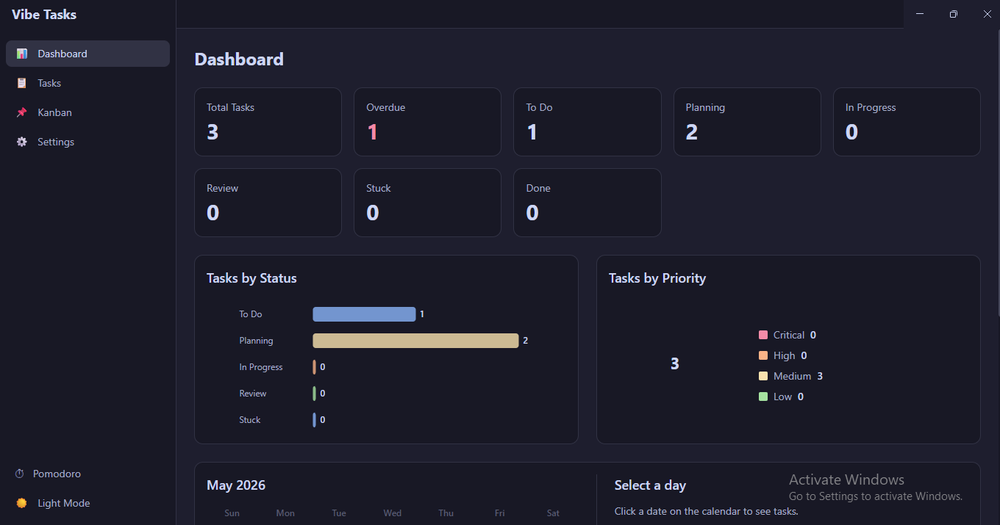

#  Vibe Tasks

> A desktop task management application built with Electron, React, SQLite, and Syncfusion Controls.

Vibe Tasks helps you organize your work with an intuitive interface featuring task lists, Kanban boards, dashboards with charts, and a Pomodoro timer — all running locally on your desktop.

## Features

- **Dashboard** — Summary cards, SVG bar chart (tasks by status), SVG pie chart (tasks by priority with dynamic colors from database), Quick Add form, calendar view with day-click for task details, Recent Tasks table with edit-on-click and archive. Assigned user shown on all task rows with email link.
- **Calendar Day Click** — Click any day to see tasks due that day in a 50/50 split view
- **Task List** — Project-wise tree grid (expandable/collapsible) with Quick Add bar supporting natural language dates (`tomorrow`, `next week`, `in 3 days`, etc.), assign user to tasks, archive button, email icon with assigned user's email, search bar
- **Task Edit Modal** — Click any task row to open an inline editor for name, description, status, priority, project, assigned user, due date, Markdown notes, and task dependencies
- **Markdown Notes** — Add notes in Markdown format to any task with live preview toggle
- **Task Dependencies** — Link predecessor and successor tasks via a searchable multi-select picker modal
- **Kanban Board** — Dynamically loads all custom statuses in order with drag-and-drop between columns; click any card to view task details, assigned user, Markdown notes preview, dependency links, email assigned user, and archive action. "Add Task" button on each column with full form.
- **Priority Colors** — Customizable color per priority, shown as a colored bar/indicator on Task List rows and Kanban cards. Progress bar hidden at 0%.
- **Inbox** — Dedicated route showing all tasks with a prominent "Due in Next 2 Days" section, sortable table with assigned user, email icon, completion %, and archive
- **Archive** — Archive/unarchive tasks with confirmation dialogs; dedicated Archived page with select-and-delete and Restore button
- **Email Integration** — 📧 icon on every task card/row opens mailto with assigned user's email, subject=task name, body=description
- **Collapsible Sidebar** — Toggle sidebar between expanded and icon-only collapsed mode for more screen space
- **Status Ordering** — ▲/▼ buttons in Settings to reorder statuses; Kanban reflects the order
- **Settings** — Tabbed CRUD for Users, Projects, Statuses, and Priorities (with color picker)
- **Pomodoro Timer** — Floating draggable window with minimize/close buttons, configurable intervals, xylophone alarm on repeat with Stop button, and Electron desktop notifications. Theme syncs live with main app.
- **Dark/Light Mode** — Theme toggle in sidebar, OS detection via prefers-color-scheme, persisted to localStorage, dynamically pushed to Pomodoro window
- **Customizable Database Location** — Choose where your SQLite database lives via Settings
- **Single Instance** — Only one instance of Vibe Tasks runs at a time; second launch focuses existing window
- **External Links** — About page links open in default browser via shell.openExternal
- **About Screen** — Dynamic version from package.json, inline SVG icon, GitHub repo link, credits to Darshan Marathe and OpenCode

## Screenshots

| Dashboard | Task List |
|---|---|
|  |  |

| Kanban Board | Settings |
|---|---|
|  |  |

| Pomodoro Timer | Calendar & Task Detail |
|---|---|
|  |  |

| Dark Mode |
|---|
|  |

## Tech Stack

| Layer | Tech |
|---|---|
| Desktop Shell | [Electron](https://www.electronjs.org/) |
| Frontend | [React 19](https://react.dev/) + [TypeScript](https://www.typescriptlang.org/) |
| Runtime | [Node.js](https://nodejs.org/) |
| Bundler | [Vite 8](https://vitejs.dev/) |
| Styling | [Tailwind CSS 3](https://tailwindcss.com/) + Admin Template |
| Database | [SQLite](https://sql.js.org/) (via sql.js) |
| Routing | [React Router 7](https://reactrouter.com/) |
| UI Controls | [Syncfusion](https://www.syncfusion.com/) (Community License) |

## Getting Started

### Prerequisites

- [Node.js](https://nodejs.org/) >= 18

### Install

```bash
npm install
```

### Run (development)

```bash
npm run dev
```

### Build

```bash
# Current platform
npm run build

# Platform-specific
npm run build:win
npm run build:win-portable
npm run build:mac
npm run build:linux

# All platforms
npm run build:all
```

## Project Structure

```
vibe-tasks/
├── electron/            # Electron main process
│   ├── main.ts          # Main process entry
│   ├── preload.ts       # Context bridge (IPC)
│   ├── preload.cjs      # Preload (CommonJS)
│   ├── pomodoro.html    # Pomodoro timer window
│   ├── pomodoroPreload.ts
│   └── database/        # SQLite + repositories
├── src/                 # React frontend
│   ├── App.tsx          # Router + layout
│   ├── main.tsx         # React entry
│   ├── components/      # Shared components
│   ├── pages/           # Page views
│   │   ├── Archived.tsx
│   │   ├── Dashboard.tsx
│   │   ├── About.tsx
│   │   ├── Inbox.tsx
│   │   ├── TaskList.tsx
│   │   ├── KanbanBoard.tsx
│   │   └── Settings/
│   ├── hooks/           # Custom React hooks
│   ├── types/           # TypeScript interfaces
│   ├── utils/           # Utilities
│   └── contexts/        # React contexts (theme, etc.)
├── assets/              # Icons, sounds
├── screenshots/         # Screenshots for README
├── scripts/             # Build scripts
└── dist-electron/       # Built electron output
```

## Models

| Model | Fields |
|---|---|
| **User** | `id`, `name`, `email` |
| **Project** | `id`, `name`, `description` |
| **Task** | `id`, `name`, `description`, `notes`, `dueDate`, `statusId`, `priorityId`, `projectId`, `predecessorIds`, `successorIds`, `archived`, `assignedTo` |
| **Status** | `id`, `name`, `ord` |
| **Priority** | `id`, `name`, `color` |

## License

[MIT](LICENSE)

---

Built by [Darshan Marathe](https://github.com/anomalyco).  
[View on GitHub](https://github.com/anomalyco/vibe-tasks)
